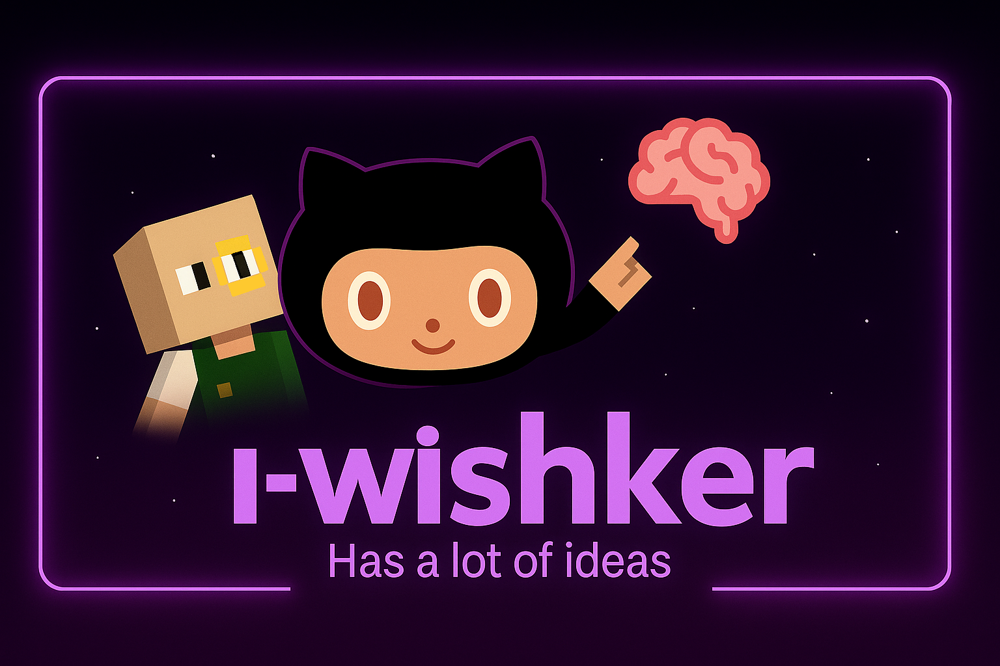

# Hey Crazy Devs! 🫛🌻ㅤㅤㅤㅤㅤ🟢ㅤㅤㅤㅤㅤ🟢🧟

## Find me on the web 🌐:
- Learning in public on [Discord](https://dsc.gg/competescraft)
- Sharing updates on [LinkedIn](https://www.linkedin.com/in/awishkar-sangraula-b4224731a/)
- Also in the coffee shop🍵!

### *Languages:* 
         
### *FrameWorks:*
       
### *Database:*
 
### *Tools:*
      
### 🎮 Play Tic Tac Toe

# 📊 GitHub Stats:

#### ***The Languages most frequently used doesn't reflect to the prophecy of other languages I've learnt***

## 🏆 Trophies

---

